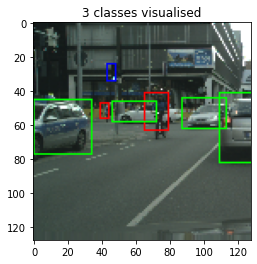

# YOLO (Anchor Based)

YOLO is an extremely fast real time multi object detection algorithm. In this project, I implemented a network to predict bounding boxes over 3 categories. Found location of object and classified using semantic labels.

 
 
